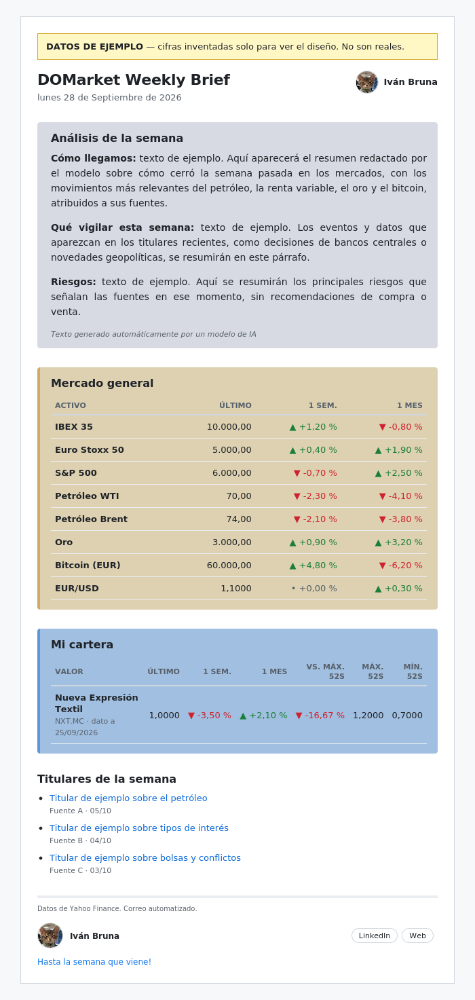

# DOMarket Weekly Brief

Un correo semanal, automátizado y gratuito, con un resumen del mercado y el
seguimiento de una cartera personal. Se genera y se envía solo, cada lunes,
con [GitHub Actions](https://github.com/features/actions).



## Qué hace

Cada lunes, sin intervención manual:

1. Descarga los precios de un puñado de índices, materias primas y divisas,
   más los de una cartera personal (`config.yml`).
2. Recoge titulares recientes de varios medios (RSS), con palabras clave
   para quedarse con lo relevante.
3. Redacta un análisis de la semana — cómo llegamos, qué vigilar, riesgos —
   con un modelo de lenguaje open source ([Gemma](https://ai.google.dev/gemma),
   ejecutado con [llama.cpp](https://github.com/ggml-org/llama.cpp)), usando
   solo los datos y titulares anteriores como contexto.
4. Compone un correo en HTML y lo envía por SMTP.
5. Si algo falla, envía un aviso aparte para que el fallo no pase
   desapercibido.

Todo el pipeline corre en los runners gratuitos de GitHub Actions: no hace
falta ningún servidor propio.

## Por qué

Proyecto personal para combinar ingeniería de datos con un caso de uso
cotidiano: un vistazo rápido y gratuito al mercado los lunes, sin pagar por
una newsletter de terceros ni depender de un servicio con mi cartera subida
a la nube de otro.

## Arquitectura

```
config.yml ──┐
             ├──> src/data.py ───────┐
             ├──> src/news.py ───────┤
             │                       ▼
             │                 src/summary.py (Gemma vía llama.cpp)
             │                       │
             └──> src/render.py <────┘
                        │
                        ▼
                  src/send.py (SMTP)
                        │
                        ▼
                 .github/workflows/resumen-semanal.yml
                 (cron semanal, todo en un runner de Actions)
```

| Módulo | Qué hace |
|---|---|
| `src/data.py` | Descarga precios con [`yfinance`](https://github.com/ranaroussi/yfinance) y calcula variaciones, máximos y mínimos de 52 semanas |
| `src/news.py` | Descarga y filtra titulares RSS/Atom; elige cuáles entran en el correo |
| `src/summary.py` | Construye el prompt y llama al modelo de IA para el análisis |
| `src/render.py` | Genera el HTML y el texto plano del correo |
| `src/send.py` | Envía el correo por SMTP |
| `src/notify.py` | Envía un aviso si el envío semanal falla |
| `src/main.py` | Orquesta todo lo anterior (punto de entrada) |

## Puesta en marcha

### 1. Clona y prepara el entorno

```bash
git clone https://github.com/ivibruna/domarket.git
cd domarket
python -m venv .venv
source .venv/bin/activate      # Windows: .venv\Scripts\activate
pip install -r requirements.txt
```

### 2. Configura el correo

Copia `.env.example` como `.env` y rellénalo:

```
SMTP_USER=tu_cuenta@gmail.com
SMTP_PASSWORD=contraseña_de_aplicación_de_16_caracteres
MAIL_TO=tu_cuenta@gmail.com
SENDER_NAME=DOMarket Weekly Brief
```

`SMTP_PASSWORD` es una
[contraseña de aplicación de Gmail](https://myaccount.google.com/apppasswords)
(necesita verificación en dos pasos activada), no tu contraseña normal.
`MAIL_TO` admite varios destinatarios separados por comas. `.env` nunca se
sube al repositorio (está en `.gitignore`).

### 3. Pruébalo en local

```bash
python -m unittest discover -s tests -t . -v   # 49 tests
python -m src.main --demo                       # vista previa con datos ficticios, sin enviar nada
python -m src.main                               # datos reales, sin enviar nada (genera preview.html)
python -m src.main --send                        # datos reales, SÍ envía el correo
```

El análisis con IA (`--ai`) necesita un servidor de
[llama.cpp](https://github.com/ggml-org/llama.cpp) corriendo en local con un
modelo Gemma cargado; en local se puede omitir y probar solo el resto. En
GitHub Actions se instala y arranca solo (ver más abajo).

### 4. Despliegue automático (GitHub Actions)

En **Settings → Secrets and variables → Actions → Repository secrets**, crea:

| Secreto | Valor |
|---|---|
| `SMTP_USER` | tu cuenta de Gmail |
| `SMTP_PASSWORD` | la contraseña de aplicación |
| `MAIL_TO` | destinatario(s) |

Con eso, `.github/workflows/resumen-semanal.yml` ya envía el correo todos los
lunes. Para probarlo sin esperar: **Actions → resumen-semanal → Run
workflow**.

## Cómo personalizarlo

Casi todo se cambia en `config.yml`, sin tocar código:

- **`general`**: los activos del resumen general (símbolo de
  [Yahoo Finance](https://finance.yahoo.com), nombre a mostrar, unidad).
- **`watchlist`**: tu cartera personal, mismo formato.
- **`news`**: las fuentes RSS, las palabras clave de filtrado y cuántos
  titulares se imprimen (`email_headlines`). El primero en español (si lo
  hay) siempre va primero.
- **`summary`**: el modelo de IA, su temperatura y su longitud máxima. El
  prompt en sí vive en `src/summary.py` (`SYSTEM_PROMPT`).
- **`brand`**: título, web, autor, LinkedIn y avatar del correo.


## Créditos y licencias

- Datos de mercado: [Yahoo Finance](https://finance.yahoo.com) vía
  [`yfinance`](https://github.com/ranaroussi/yfinance) (Apache 2.0). Uso
  personal, no oficial.
- Modelo de lenguaje: [Gemma](https://ai.google.dev/gemma) de Google
  (Apache 2.0), ejecutado con [`llama.cpp`](https://github.com/ggml-org/llama.cpp)
  (MIT). Ninguno de los dos se redistribuye en este repositorio: se
  descargan en cada ejecución.
- Titulares: CNBC, BBC, MarketWatch, elEconomista, BCE y la Reserva Federal,
  vía sus feeds RSS públicos.
- Código de este repositorio: licencia MIT (ver [`LICENSE`](LICENSE)).

## Aviso legal

Este correo tiene fines informativos y personales. No es asesoramiento
financiero ni una recomendación de compra o venta, ni de ninguna entidad o
empleador. El bloque de análisis lo redacta un modelo de IA y puede
contener errores.
